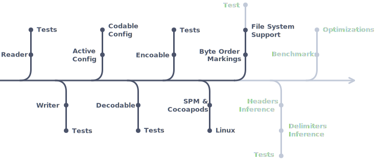

<p align="center">
    
</p>

<p align="center">
    <a href="https://swift.org/about/#swiftorg-and-open-source"></a>
    <a href="https://github.com/dehesa/CodableCSV/wiki/Implicit-dependencies"></a>
    <a href="https://ubuntu.com"></a>
    <a href="http://doge.mit-license.org"></a>
</p>

[CodableCSV](https://github.com/dehesa/CodableCSV) provides:

-   Imperative CSV reader/writer.
-   Declarative CSV encoder/decoder.
-   Support multiple inputs/outputs: `String`s, `Data` blobs, `URL`s, and `Stream`s (commonly used for `stdin`).
-   Support numerous string encodings and [Byte Order Markers](https://en.wikipedia.org/wiki/Byte_order_mark) (BOM).
-   Extensive configuration: delimiters, escaping scalar, trim strategy, codable strategies, presampling, etc.
-   [RFC4180](https://tools.ietf.org/html/rfc4180) compliant with default configuration and CRLF (`\r\n`) row delimiter.
-   Multiplatform support with no dependencies (the Swift Standard Library and Foundation are implicit dependencies).

# Usage

To use this library, you need to:

<ul>
<details><summary>Add <code>CodableCSV</code> to your project.</summary><p>

You can choose to add the library through SPM or Cocoapods:

-   [SPM](https://github.com/apple/swift-package-manager/tree/master/Documentation) (Swift Package Manager).

    ```swift
    // swift-tools-version:5.1
    import PackageDescription

    let package = Package(
        /* Your package name, supported platforms, and generated products go here */
        dependencies: [
            .package(url: "https://github.com/dehesa/CodableCSV.git", from: "0.6.6")
        ],
        targets: [
            .target(name: /* Your target name here */, dependencies: ["CodableCSV"])
        ]
    )
    ```

-   [Cocoapods](https://cocoapods.org).

    ```
    pod 'CodableCSV', '~> 0.6.6'
    ```

</p></details>

<details><summary>Import <code>CodableCSV</code> in the file that needs it.</summary><p>

```swift
import CodableCSV
```

</p></details>
</ul>

There are two ways to use this library:

1. imperatively, as a row-by-row and field-by-field reader/writer.
2. declaratively, through Swift's `Codable` interface.

## Imperative Reader/Writer

The following types provide imperative control on how to read/write CSV data.

<ul>
<details><summary><code>CSVReader</code></summary><p>

A `CSVReader` parses CSV data from a given input (`String`, `Data`, `URL`, or `InputStream`) and returns CSV rows as a `String`s array. `CSVReader` can be used at a _high-level_, in which case it parses an input completely; or at a _low-level_, in which each row is decoded when requested.

-   Complete input parsing.

    ```swift
    let data: Data = ...
    let result = try CSVReader.decode(input: data)
    ```

    Once the input is completely parsed, you can choose how to access the decoded data:

    ```swift
    let headers: [String] = result.headers
    // Access the CSV rows (i.e. raw [String] values)
    let rows = result.rows
    let row = result[0]
    // Access the CSV record (i.e. convenience structure over a single row)
    let records = result.records
    let record = result[record: 0]
    // Access the CSV columns through indices or header values.
    let columns = result.columns
    let column = result[column: 0]
    let column = result[column: "Name"]
    // Access fields through indices or header values.
    let fieldB: String = result[row: 3, column: 2]
    let fieldA: String? = result[row: 2, column: "Age"]
    ```

-   Row-by-row parsing.

    ```swift
    let reader = try CSVReader(input: string) { $0.headerStrategy = .firstLine }
    let rowA = try reader.readRow()
    ```

    Parse a row at a time, till `nil` is returned; or exit the scope and the reader will clean up all used memory.

    ```swift
    // Let's assume the input is:
    let string = "numA,numB,numC\n1,2,3\n4,5,6\n7,8,9"
    // The headers property can be accessed at any point after initialization.
    let headers: [String] = reader.headers  // ["numA", "numB", "numC"]
    // Keep querying rows till `nil` is received.
    guard let rowB = try reader.readRow(),  // ["4", "5", "6"]
          let rowC = try reader.readRow()   /* ["7", "8", "9"] */ else { ... }
    ```

    Alternatively you can use the `readRecord()` function which also returns the next CSV row, but it wraps the result in a convenience structure. This structure lets you access each field with the header name (as long as the `headerStrategy` is marked with `.firstLine`).

    ```swift
    let reader = try CSVReader(input: string) { $0.headerStrategy = .firstLine }
    let headers = reader.headers      // ["numA", "numB", "numC"]

    let recordA = try reader.readRecord()
    let rowA = recordA.row         // ["1", "2", "3"]
    let fieldA = recordA[0]        // "1"
    let fieldB = recordA["numB"]   // "2"

    let recordB = try reader.readRecord()
    ```

-   `Sequence` syntax parsing.

    ```swift
    let reader = try CSVReader(input: URL(...), configuration: ...)
    for row in reader {
        // Do something with the row: [String]
    }
    ```

    Please note the `Sequence` syntax (i.e. `IteratorProtocol`) doesn't throw errors; therefore if the CSV data is invalid, the previous code will crash. If you don't control the CSV data origin, use `readRow()` instead.

### Reader Configuration

`CSVReader` accepts the following configuration properties:

-   `encoding` (default `nil`) specify the CSV file encoding.

    This `String.Encoding` value specify how each underlying byte is represented (e.g. `.utf8`, `.utf32littleEndian`, etc.). If it is `nil`, the library will try to figure out the file encoding through the file's [Byte Order Marker](https://en.wikipedia.org/wiki/Byte_order_mark). If the file doesn't contain a BOM, `.utf8` is presumed.

-   `delimiters` (default `(field: ",", row: "\n")`) specify the field and row delimiters.

    CSV fields are separated within a row with _field delimiters_ (commonly a "comma"). CSV rows are separated through _row delimiters_ (commonly a "line feed"). You can specify any unicode scalar, `String` value, or `nil` for unknown delimiters.

-   `escapingStrategy` (default `"`) specify the Unicode scalar used to escape fields.

    CSV fields can be escaped in case they contain privilege characters, such as field/row delimiters. Commonly the escaping character is a double quote (i.e. `"`), by setting this configuration value you can change it (e.g. a single quote), or disable the escaping functionality.

-   `headerStrategy` (default `.none`) indicates whether the CSV data has a header row or not.

    CSV files may contain an optional header row at the very beginning. This configuration value lets you specify whether the file has a header row or not, or whether you want the library to figure it out.

-   `trimStrategy` (default empty set) trims the given characters at the beginning and end of each parsed field.

    The trim characters are applied for the escaped and unescaped fields. The set cannot include any of the delimiter characters or the escaping scalar. If so, an error will be thrown during initialization.

-   `presample` (default `false`) indicates whether the CSV data should be completely loaded into memory before parsing begins.

    Loading all data into memory may provide faster iteration for small to medium size files, since you get rid of the overhead of managing an `InputStream`.

The configuration values are set during initialization and can be passed to the `CSVReader` instance through a structure or with a convenience closure syntax:

```swift
let reader = CSVReader(input: ...) {
    $0.encoding = .utf8
    $0.delimiters.row = "\r\n"
    $0.headerStrategy = .firstLine
    $0.trimStrategy = .whitespaces
}
```

</p></details>

<details><summary><code>CSVWriter</code></summary><p>

A `CSVWriter` encodes CSV information into a specified target (i.e. a `String`, or `Data`, or a file). It can be used at a _high-level_, by encoding completely a prepared set of information; or at a _low-level_, in which case rows or fields can be written individually.

-   Complete CSV rows encoding.

    ```swift
    let input = [
        ["numA", "numB", "name"        ],
        ["1"   , "2"   , "Marcos"      ],
        ["4"   , "5"   , "Marine-Anaïs"]
    ]
    let data   = try CSVWriter.encode(rows: input)
    let string = try CSVWriter.encode(rows: input, into: String.self)
    try CSVWriter.encode(rows: input, into: URL("~/Desktop/Test.csv")!, append: false)
    ```

-   Row-by-row encoding.

    ```swift
    let writer = try CSVWriter(fileURL: URL("~/Desktop/Test.csv")!, append: false)
    for row in input {
        try writer.write(row: row)
    }
    try writer.endEncoding()
    ```

    Alternatively, you may write directly to a buffer in memory and access its `Data` representation.

    ```swift
    let writer = try CSVWriter { $0.headers = input[0] }
    for row in input.dropFirst() {
        try writer.write(row: row)
    }
    try writer.endEncoding()
    let result = try writer.data()
    ```

-   Field-by-field encoding.

    ```swift
    let writer = try CSVWriter(fileURL: URL("~/Desktop/Test.csv")!, append: false)
    try writer.write(row: input[0])

    input[1].forEach {
        try writer.write(field: field)
    }
    try writer.endRow()

    try writer.write(fields: input[2])
    try writer.endRow()

    try writer.endEncoding()
    ```

    `CSVWriter` has a wealth of low-level imperative APIs, that let you write one field, several fields at a time, end a row, write an empty row, etc.

    > Please notice that a CSV requires all rows to have the same amount of fields.

    `CSVWriter` enforces this by throwing an error when you try to write more the expected amount of fields, or filling a row with empty fields when you call `endRow()` but not all fields have been written.

### Writer Configuration

`CSVWriter` accepts the following configuration properties:

-   `delimiters` (default `(field: ",", row: "\n")`) specify the field and row delimiters.

    CSV fields are separated within a row with _field delimiters_ (commonly a "comma"). CSV rows are separated through _row delimiters_ (commonly a "line feed"). You can specify any unicode scalar, `String` value, or `nil` for unknown delimiters.

-   `escapingStrategy` (default `.doubleQuote`) specify the Unicode scalar used to escape fields.

    CSV fields can be escaped in case they contain privilege characters, such as field/row delimiters. Commonly the escaping character is a double quote (i.e. `"`), by setting this configuration value you can change it (e.g. a single quote), or disable the escaping functionality.

-   `headers` (default `[]`) indicates whether the CSV data has a header row or not.

    CSV files may contain an optional header row at the very beginning. If this configuration value is empty, no header row is written.

-   `encoding` (default `nil`) specify the CSV file encoding.

    This `String.Encoding` value specify how each underlying byte is represented (e.g. `.utf8`, `.utf32littleEndian`, etc.). If it is `nil`, the library will try to figure out the file encoding through the file's [Byte Order Marker](https://en.wikipedia.org/wiki/Byte_order_mark). If the file doesn't contain a BOM, `.utf8` is presumed.

-   `bomStrategy` (default `.convention`) indicates whether a Byte Order Marker will be included at the beginning of the CSV representation.

    The OS convention is that BOMs are never written, except when `.utf16`, `.utf32`, or `.unicode` string encodings are specified. You could however indicate that you always want the BOM written (`.always`) or that is never written (`.never`).

The configuration values are set during initialization and can be passed to the `CSVWriter` instance through a structure or with a convenience closure syntax:

```swift
let writer = CSVWriter(fileURL: ...) {
    $0.delimiters.row = "\r\n"
    $0.headers = ["Name", "Age", "Pet"]
    $0.encoding = .utf8
    $0.bomStrategy = .never
}
```

</p></details>

<details><summary><code>CSVError</code></summary><p>

Many of `CodableCSV`'s imperative functions may throw errors due to invalid configuration values, invalid CSV input, file stream failures, etc. All these throwing operations exclusively throw `CSVError`s that can be easily caught with `do`-`catch` clause.

```swift
do {
    let writer = try CSVWriter()
    for row in customData {
        try writer.write(row: row)
    }
} catch let error {
    print(error)
}
```

`CSVError` adopts Swift Evolution's [SE-112 protocols](https://github.com/apple/swift-evolution/blob/master/proposals/0112-nserror-bridging.md) and `CustomDebugStringConvertible`. The error's properties provide rich commentary explaining what went wrong and indicate how to fix the problem.

-   `type`: The error group category.
-   `failureReason`: Explanation of what went wrong.
-   `helpAnchor`: Advice on how to solve the problem.
-   `errorUserInfo`: Arguments associated with the operation that threw the error.
-   `underlyingError`: Optional underlying error, which provoked the operation to fail (most of the time is `nil`).
-   `localizedDescription`: Returns a human readable string with all the information contained in the error.

<br>You can get all the information by simply printing the error or calling the `localizedDescription` property on a properly casted `CSVError<CSVReader>` or `CSVError<CSVWriter>`.

</p></details>
</ul>

## Declarative Decoder/Encoder

The encoders/decoders provided by this library let you use Swift's `Codable` declarative approach to encode/decode CSV data.

<ul>
<details><summary><code>CSVDecoder</code></summary><p>

`CSVDecoder` transforms CSV data into a Swift type conforming to `Decodable`. The decoding process is very simple and it only requires creating a decoding instance and call its `decode` function passing the `Decodable` type and the input data.

```swift
let decoder = CSVDecoder()
let result = try decoder.decode(CustomType.self, from: data)
```

`CSVDecoder` can decode CSVs represented as a `Data` blob, a `String`, an actual file in the file system, or an `InputStream` (e.g. `stdin`).

```swift
let decoder = CSVDecoder { $0.bufferingStrategy = .sequential }
let content = try decoder.decode([Student].self, from: URL("~/Desktop/Student.csv"))
```

If you are dealing with a big CSV file, it is preferred to used direct file decoding, a `.sequential` or `.unrequested` buffering strategy, and set _presampling_ to false; since then memory usage is drastically reduced.

### Decoder Configuration

The decoding process can be tweaked by specifying configuration values at initialization time. `CSVDecoder` accepts the same configuration values as `CSVReader` plus the following ones:

-   `nilStrategy` (default: `.empty`) indicates how the `nil` _concept_ (absence of value) is represented on the CSV.

-   `boolStrategy` (default: `.insensitive`) defines how strings are decoded to `Bool` values.

-   `nonConformingFloatStrategy` (default `.throw`) specifies how to handle non-numbers (e.g. `NaN` and infinity).

-   `decimalStrategy` (default `.locale`) indicates how strings are decoded to `Decimal` values.

-   `dateStrategy` (default `.deferredToDate`) specify how strings are decoded to `Date` values.

-   `dataStrategy` (default `.base64`) indicates how strings are decoded to `Data` values.

-   `bufferingStrategy` (default `.keepAll`) controls the behavior of `KeyedDecodingContainer`s.

    Selecting a buffering strategy affects the decoding performance and the amount of memory used during the decoding process. For more information check the README's [Tips using `Codable`](#Tips-using-codable) section and the [`Strategy.DecodingBuffer` definition](sources/declarative/decodable/DecoderConfiguration.swift).

The configuration values can be set during `CSVDecoder` initialization or at any point before the `decode` function is called.

```swift
let decoder = CSVDecoder {
    $0.encoding = .utf8
    $0.delimiters.field = "\t"
    $0.headerStrategy = .firstLine
    $0.bufferingStrategy = .keepAll
    $0.decimalStrategy = .custom({ (decoder) in
        let value = try Float(from: decoder)
        return Decimal(value)
    })
}
```

</p></details>

<details><summary><code>CSVDecoder.Lazy</code></summary><p>

A CSV input can be decoded _on demand_ (i.e. row-by-row) with the decoder's `lazy(from:)` function.

```swift
let decoder = CSVDecoder(configuration: config).lazy(from: fileURL)
let student1 = try decoder.decodeRow(Student.self)
let student2 = try decoder.decodeRow(Student.self)
```

`CSVDecoder.Lazy` conforms to Swift's [`Sequence` protocol](https://developer.apple.com/documentation/swift/sequence), letting you use functionality such as `map()`, `allSatisfy()`, etc. Please note, `CSVDecoder.Lazy` cannot be used for repeated access; It _consumes_ the input CSV.

```swift
let decoder = CSVDecoder().lazy(from: fileData)
let students = try decoder.map { try $0.decode(Student.self) }
```

A nice benefit of using the _lazy_ operation, is that it lets you switch how a row is decoded at any point. For example:
```swift
let decoder = CSVDecoder().lazy(from: fileString)
// The first 100 rows are students.
let students = (  0..<100).map { _ in try decoder.decode(Student.self) }
// The second 100 rows are teachers.
let teachers = (100..<110).map { _ in try decoder.decode(Teacher.self) }
```

Since `CSVDecoder.Lazy` exclusively provides sequential access; setting the buffering strategy to `.sequential` will reduce the decoder's memory usage.

```swift
let decoder = CSVDecoder {
    $0.headerStrategy = .firstLine
    $0.bufferingStrategy = .sequential
}.lazy(from: fileURL)
```

</p></details>

<details><summary><code>CSVEncoder</code></summary><p>

`CSVEncoder` transforms Swift types conforming to `Encodable` into CSV data. The encoding process is very simple and it only requires creating an encoding instance and call its `encode` function passing the `Encodable` value.

```swift
let encoder = CSVEncoder()
let data = try encoder.encode(value, into: Data.self)
```

The `Encoder`'s `encode()` function creates a CSV file as a `Data` blob, a `String`, or an actual file in the file system.

```swift
let encoder = CSVEncoder { $0.headers = ["name", "age", "hasPet"] }
try encoder.encode(value, into: URL("~/Desktop/Students.csv"))
```

If you are dealing with a big CSV content, it is preferred to use direct file encoding and a `.sequential` or `.assembled` buffering strategy, since then memory usage is drastically reduced.

### Encoder Configuration

The encoding process can be tweaked by specifying configuration values. `CSVEncoder` accepts the same configuration values as `CSVWriter` plus the following ones:

-   `nilStrategy` (default: `.empty`) indicates how the `nil` _concept_ (absence of value) is represented on the CSV.

-   `boolStrategy` (default: `.deferredToString`) defines how Boolean values are encoded to `String` values.

-   `nonConformingFloatStrategy` (default `.throw`) specifies how to handle non-numbers (i.e. `NaN` and infinity).

-   `decimalStrategy` (default `.locale`) indicates how decimal numbers are encoded to `String` values.

-   `dateStrategy` (default `.deferredToDate`) specify how dates are encoded to `String` values.

-   `dataStrategy` (default `.base64`) indicates how data blobs are encoded to `String` values.

-   `bufferingStrategy` (default `.keepAll`) controls the behavior of `KeyedEncodingContainer`s.

    Selecting a buffering strategy directly affect the encoding performance and the amount of memory used during the process. For more information check this README's [Tips using `Codable`](#Tips-using-codable) section and the [`Strategy.EncodingBuffer` definition](sources/declarative/encodable/EncoderConfiguration.swift).

The configuration values can be set during `CSVEncoder` initialization or at any point before the `encode` function is called.

```swift
let encoder = CSVEncoder {
    $0.headers = ["name", "age", "hasPet"]
    $0.delimiters = (field: ";", row: "\r\n")
    $0.dateStrategy = .iso8601
    $0.bufferingStrategy = .sequential
    $0.floatStrategy = .convert(positiveInfinity: "∞", negativeInfinity: "-∞", nan: "≁")
    $0.dataStrategy = .custom({ (data, encoder) in
        let string = customTransformation(data)
        var container = try encoder.singleValueContainer()
        try container.encode(string)
    })
}
```

> The `.headers` configuration is required if you are using keyed encoding container.

</p></details>

<details><summary><code>CSVEncoder.Lazy</code></summary><p>

A series of codable types (representing CSV rows) can be encoded _on demand_ with the encoder's `lazy(into:)` function.

```swift
let encoder = CSVEncoder().lazy(into: Data.self)
for student in students {
    try encoder.encodeRow(student)
}
let data = try encoder.endEncoding()
```

Call `endEncoding()` once there is no more values to be encoded. The function will return the encoded CSV.
```swift
let encoder = CSVEncoder().lazy(into: String.self)
students.forEach {
    try encoder.encode($0)
}
let string = try encoder.endEncoding()
```

A nice benefit of using the _lazy_ operation, is that it lets you switch how a row is encoded at any point. For example:
```swift
let encoder = CSVEncoder(configuration: config).lazy(into: fileURL)
students.forEach { try encoder.encode($0) }
teachers.forEach { try encoder.encode($0) }
try encoder.endEncoding()
```

Since `CSVEncoder.Lazy` exclusively provides sequential encoding; setting the buffering strategy to `.sequential` will reduce the encoder's memory usage.

```swift
let encoder = CSVEncoder {
    $0.bufferingStrategy = .sequential
}.lazy(into: String.self)
```

</p></details>
</ul>

### Tips using `Codable`

`Codable` is fairly easy to use and most Swift standard library types already conform to it. However, sometimes it is tricky to get custom types to comply to `Codable` for specific functionality.

<ul>
<details><summary>Basic adoption.</summary><p>

When a custom type conforms to `Codable`, the type is stating that it has the ability to decode itself from and encode itself to a external representation. Which representation depends on the decoder or encoder chosen. Foundation provides support for [JSON and Property Lists](https://developer.apple.com/documentation/foundation/archives_and_serialization) and the community provide many other formats, such as: [YAML](https://github.com/jpsim/Yams), [XML](https://github.com/MaxDesiatov/XMLCoder), [BSON](https://github.com/OpenKitten/BSON), and CSV (through this library).

Usually a CSV represents a long list of _entities_. The following is a simple example representing a list of students.

```swift
let string = """
    name,age,hasPet
    John,22,true
    Marine,23,false
    Alta,24,true
    """
```

A _student_ can be represented as a structure:

```swift
struct Student: Codable {
    var name: String
    var age: Int
    var hasPet: Bool
}
```

To decode the list of students, create a decoder and call `decode` on it passing the CSV sample.

```swift
let decoder = CSVDecoder { $0.headerStrategy = .firstLine }
let students = try decoder.decode([Student].self, from: string)
```

The inverse process (from Swift to CSV) is very similar (and simple).

```swift
let encoder = CSVEncoder { $0.headers = ["name", "age", "hasPet"] }
let newData = try encoder.encode(students)
```

</p></details>

<details><summary>Specific behavior for CSV data.</summary><p>

When encoding/decoding CSV data, it is important to keep several points in mind:

</p>
<ul>
<details><summary><code>Codable</code>'s automatic synthesis requires CSV files with a headers row.</summary><p>

`Codable` is able to synthesize `init(from:)` and `encode(to:)` for your custom types when all its members/properties conform to `Codable`. This automatic synthesis create a hidden `CodingKeys` enumeration containing all your property names.

During decoding, `CSVDecoder` tries to match the enumeration string values with a field position within a row. For this to work the CSV data must contain a _headers row_ with the property names. If your CSV doesn't contain a _headers row_, you can specify coding keys with integer values representing the field index.

```swift
struct Student: Codable {
    var name: String
    var age: Int
    var hasPet: Bool

    private enum CodingKeys: Int, CodingKey {
        case name = 0
        case age = 1
        case hasPet = 2
    }
}
```

> Using integer coding keys has the added benefit of better encoder/decoder performance. By explicitly indicating the field index, you let the decoder skip the functionality of matching coding keys string values to headers.

</p></details>
<details><summary>A CSV is a long list of rows/records.</summary><p>

CSV formatted data is commonly used with flat hierarchies (e.g. a list of students, a list of car models, etc.). Nested structures, such as the ones found in JSON files, are not supported by default in CSV implementations (e.g. a list of users, where each user has a list of services she uses, and each service has a list of the user's configuration values).

You can support complex structures in CSV, but you would have to flatten the hierarchy in a single model or build a custom encoding/decoding process. This process would make sure there is always a maximum of two keyed/unkeyed containers.

As an example, we can create a nested structure for a school with students who own pets.

```swift
struct School: Codable {
    let students: [Student]
}

struct Student: Codable {
    var name: String
    var age: Int
    var pet: Pet
}

struct Pet: Codable {
    var nickname: String
    var gender: Gender

    enum Gender: Codable {
        case male, female
    }
}
```

By default the previous example wouldn't work. If you want to keep the nested structure, you need to overwrite the custom `init(from:)` implementation (to support `Decodable`).

```swift
extension School {
    init(from decoder: Decoder) throws {
        var container = try decoder.unkeyedContainer()
        while !container.isAtEnd {
            self.student.append(try container.decode(Student.self))
        }
    }
}

extension Student {
    init(from decoder: Decoder) throws {
        var container = try decoder.container(keyedBy: CustomKeys.self)
        self.name = try container.decode(String.self, forKey: .name)
        self.age = try container.decode(Int.self, forKey: .age)
        self.pet = try decoder.singleValueContainer.decode(Pet.self)
    }
}

extension Pet {
    init(from decoder: Decoder) throws {
        var container = try decoder.container(keyedBy: CustomKeys.self)
        self.nickname = try container.decode(String.self, forKey: .nickname)
        self.gender = try container.decode(Gender.self, forKey: .gender)
    }
}

extension Pet.Gender {
    init(from decoder: Decoder) throws {
        var container = try decoder.singleValueContainer()
        self = try container.decode(Int.self) == 1 ? .male : .female
    }
}

private CustomKeys: Int, CodingKey {
    case name = 0
    case age = 1
    case nickname = 2
    case gender = 3
}
```

You could have avoided building the initializers overhead by defining a flat structure such as:

```swift
struct Student: Codable {
    var name: String
    var age: Int
    var nickname: String
    var gender: Gender

    enum Gender: Int, Codable {
        case male = 1
        case female = 2
    }
}
```

</p></details>
</ul>

</details>

<details><summary>Encoding/decoding strategies.</summary><p>

[SE167](https://github.com/apple/swift-evolution/blob/master/proposals/0167-swift-encoders.md) proposal introduced to Foundation JSON and PLIST encoders/decoders. This proposal also featured encoding/decoding strategies as a new way to configure the encoding/decoding process. `CodableCSV` continues this _tradition_ and mirrors such strategies including some new ones specific to the CSV file format.

To configure the encoding/decoding process, you need to set the configuration values of the `CSVEncoder`/`CSVDecoder` before calling the `encode()`/`decode()` functions. There are two ways to set configuration values:

-   At initialization time, passing the `Configuration` structure to the initializer.

    ```swift
    var config = CSVDecoder.Configuration()
    config.nilStrategy = .empty
    config.decimalStrategy = .locale(.current)
    config.dataStrategy = .base64
    config.bufferingStrategy = .sequential
    config.trimStrategy = .whitespaces
    config.encoding = .utf16
    config.delimiters.row = "\r\n"

    let decoder = CSVDecoder(configuration: config)
    ```

    Alternatively, there are convenience initializers accepting a closure with a `inout Configuration` value.

    ```swift
    let decoder = CSVDecoder {
        $0.nilStrategy = .empty
        $0.decimalStrategy = .locale(.current)
        // and so on and so forth
    }
    ```

-   `CSVEncoder` and `CSVDecoder` implement `@dynamicMemberLookup` exclusively for their configuration values. Therefore you can set configuration values after initialization or after a encoding/decoding process has been performed.

    ```swift
    let decoder = CSVDecoder()
    decoder.bufferingStrategy = .sequential
    decoder.decode([Student].self, from: url1)

    decoder.bufferingStrategy = .keepAll
    decoder.decode([Pets].self, from: url2)
    ```

The strategies labeled with `.custom` let you insert behavior into the encoding/decoding process without forcing you to manually conform to `init(from:)` and `encode(to:)`. When set, they will reference the targeted type for the whole process. For example, if you want to encode a CSV file where empty fields are marked with the word `null` (for some reason). You could do the following:

```swift
let decoder = CSVDecoder()
decoder.nilStrategy = .custom({ (encoder) in
    var container = encoder.singleValueContainer()
    try container.encode("null")
})
```

</p></details>

<details><summary>Type-safe headers row.</summary><p>

You can generate type-safe name headers using Swift introspection tools (i.e. `Mirror`) or explicitly defining the `CodingKey` enum with `String` raw value conforming to `CaseIterable`.

```swift
struct Student {
    var name: String
    var age: Int
    var hasPet: Bool

    enum CodingKeys: String, CodingKey, CaseIterable {
        case name, age, hasPet
    }
}
```

Then configure your encoder with explicit headers.

```swift
let encoder = CSVEncoder {
    $0.headers = Student.CodingKeys.allCases.map { $0.rawValue }
}
```

</p></details>

<details><summary>Performance advices.</summary><p>

#warning("TODO:")

</p></details>
</ul>

# Roadmap

<p align="center">

</p>

The library has been heavily documented and any contribution is welcome. Check the small [How to contribute](docs/CONTRIBUTING.md) document or take a look at the [Github projects](https://github.com/dehesa/CodableCSV/projects) for a more in-depth roadmap.

### Community

If `CodableCSV` is not of your liking, the Swift community offers other CSV solutions:

-   [CSV.swift](https://github.com/yaslab/CSV.swift) contains an imperative CSV reader/writer and a _lazy_ row decoder and adheres to the [RFC4180](https://tools.ietf.org/html/rfc4180) standard.
-   [SwiftCSV](https://github.com/swiftcsv/SwiftCSV) is a well-tested parse-only library which loads the whole CSV in memory (not intended for large files).
-   [CSwiftV](https://github.com/Daniel1of1/CSwiftV) is a parse-only library which loads the CSV in memory and parses it in a single go (no imperative reading).
-   [CSVImporter](https://github.com/Flinesoft/CSVImporter) is an asynchronous parse-only library with support for big CSV files (incremental loading).
-   [SwiftCSVExport](https://github.com/vigneshuvi/SwiftCSVExport) reads/writes CSV imperatively with Objective-C support.
-   [swift-csv](https://github.com/brutella/swift-csv) offers an imperative CSV reader/writer based on Foundation's streams.

There are many good tools outside the Swift community. Since writing them all would be a hard task, I will just point you to the great [AwesomeCSV](https://github.com/secretGeek/awesomeCSV) github repo. There are a lot of treasures to be found there.
