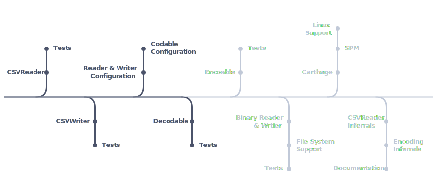

<p align="center">
    
</p>

CodableCSV allows you to read and write CSV files row-by-row or through Swift's Codable interface.

  [](http://doge.mit-license.org) [](https://travis-ci.com/dehesa/CodableCSV)

This framework provides:

-   Active row-by-row **CSV reader & writer**.
-   **Swift's Codable** interface.
-   Support for multiple inputs/outputs: in-memory, file system, binary socket, etc.
-   CSV encoding & configuration inferral (e.g. what field/row delimiters are being used).
-   Multiplatform support & **no dependencies**.

# Usage

Swift's Codable is one of the easiest way to interface with encoded files (e.g. JSON, PLIST, and now CSV).

## Decodable

```swift
import CodableCSV

let decoder = CSVDecoder()
decoder.delimiters = (.comma, .lineFeed)
let result = try decoder.decode(CustomType.self, from: data)
```

The process to decode a CSV file into a custom type is the following:

1. Create a decoder.
2. Optionally pass any configuration you want for the decoder.
   <br>`(.comma, .lineFeed)` are actually the defaults and do not need to be writen.
3. Decode the file (from an already preloaded datablob or a file in the file system) into a given type.
   <br>The type passed as argument must implement `Decodable`. Most Swift Standard Library types already conform to `Codable`.
    ```swift
    // Easiest way to access CSV data
    let rows = try decoder.decode([[String]].self, from: data).
    ```

For custom types:

1. Define the `Decodable` implementation.
2. Implement the `init(from:)` initializer if needed (many times you won't need to).
3. Remember that a CSV file is made of rows and each row contains several fields (how many will depend on the file).
   This means that you should only query for two levels of nested containers.

```swift
struct School: Decodable {
    // The custom CSV file is a list of all the students.
    let people: [Student]
}

struct Student: Decodable {
    let name: String
    let age: Int
    let hasPet: Bool
}
```

The previous example will work if the CSV file has a header row and the header titles match exactly the property names (`name`, `age`, and `hasPet`). A more efficient and detailed implementation:

```swift
struct Student: Decodable {
    let name: String
    let age: Int
    let hasPet: Bool

    init(from decoder: Decoder) throws {
        var row = try decoder.unkeyedContainer()
        self.name = try row.decode(String.self)
        self.age = try row.decode(Int.self)
        self.hasPet = try row.decode(Boolean.self)
    }
}
```

## CSV Reader

You can reap the benefits from the CSV parser just by calling the single static function `parse` on a string or data blob (containing an encoded CSV file).

```swift
let (headers, rows) = try CSVReader.parse(data: input)
// `headers` is a [String]? and `rows` is a [[String]]
```

Optionally you can specify configuration variables specifying such things as the field and row delimiters or whether the file has a header row.

You could also initialize a `CSVReader` instance and parse rows step by step.

```swift
let reader = try CSVReader(string: input)
while let row = try reader.parseRow() {
    // Do something with each row
}
```

Since `CSVReader` conforms to `Sequence` and `IteratorProtocol` you can use for-in loops. Be aware that the loop will crash if the CSV is malformed (a.k.a. there are invalid characters). If you are not sure, use the safer `parseRow()` instead.

```swift
let reader = try CSVReader(data: data)
for row in reader {
    // Do something with each row
}
```

## CSV Writer

The CSV writer instance has a convenience static function that allows you to swiftly create a data blob from a sequence of rows.

```swift
let rows: [[String] = ...
let data = try CSVWriter.data(rows: rows)
```

Similarly to `CSVReader` you can specify configuration variables such as file encoding or field and row delimiters.

If you want a more incremental way of writing data, you can instantiate `CSVWriter` and call its public functions depending on your needs.

```swift
let writer = try CSVWriter(url: url, configuration: .init(headers: ["ID", "Name", "Age", "hasPet"]))

for student in school {
    try writer.write(field: student.id)
    try writer.write(field: student.name)
    try writer.write(field: String(student.age))
    try writer.write(field: String(student.hasPet))
    try writer.endRow()
}

for array in summerCamp {
    try writer.write(row: array)
}
```

# Roadmap

<p align="center">

</p>
